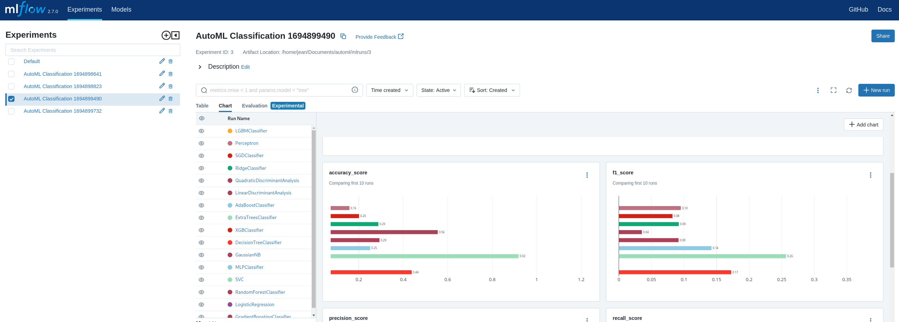

# Automl With Mlflow From Scratch

AutoMLClassification is a Python module for automating the process of selecting the best machine learning model for classification tasks. It leverages the scikit-learn and XGBoost libraries and uses a combination of random search and cross-validation to tune hyperparameters. The module is also integrated with MLflow for experiment tracking and model serialization. 

## Features

- **Automated Machine Learning**: Automatically preprocesses the dataset, selects the best model from a predefined list, and tunes its hyperparameters.
- **Parallel Processing**: Uses all available CPU cores for model fitting and hyperparameter tuning.
- **Model Serialization**: Serializes all models and their reports in files during the fitting process.
- **Experiment Tracking**: Logs all experiments, including model parameters, metrics, and models, using MLflow.
- **Customizable**: Allows the user to specify the models, hyperparameter ranges, and number of iterations for random search.

To view and plot metrics (accuracy, f1, precision, recall), open a web browser and navigate to http://0.0.0.0:5000.


## Usage

Here is a basic example of how to use the `AutoMLClassification` class:

```python
from automl.automl import AutoMLClassification

# Load your data
# X, y = ...

# Initialize the AutoMLClassification object
automl = AutoMLClassification(experiment_name='my_experiment')

X_train = pd.DataFrame(X_train)
preprocesor = build_classification_preprocessor(X_train)

auto_ml = AutoMLClassification(
        n_iter=10,
        cv=3,
        random_state=42,
        experiment_name="AutoML Classification",
    )
auto_ml.fit(X_train, y_train)

# The best models will be stored in automl.best_models_
print(automl.best_models_)
``````


## Scripts

* `run.sh`: This script sets up and runs the entire application. It checks for a virtual environment and installs the required packages listed in requirements.txt. It also starts the MLflow server, runs the main.py script, and then stops the MLflow server and deactivates the virtual environment.

* `spin_mlflow`: This script starts the MLflow server. It checks for a virtual environment and installs the required packages listed in requirements.txt. Then it starts the MLflow server.